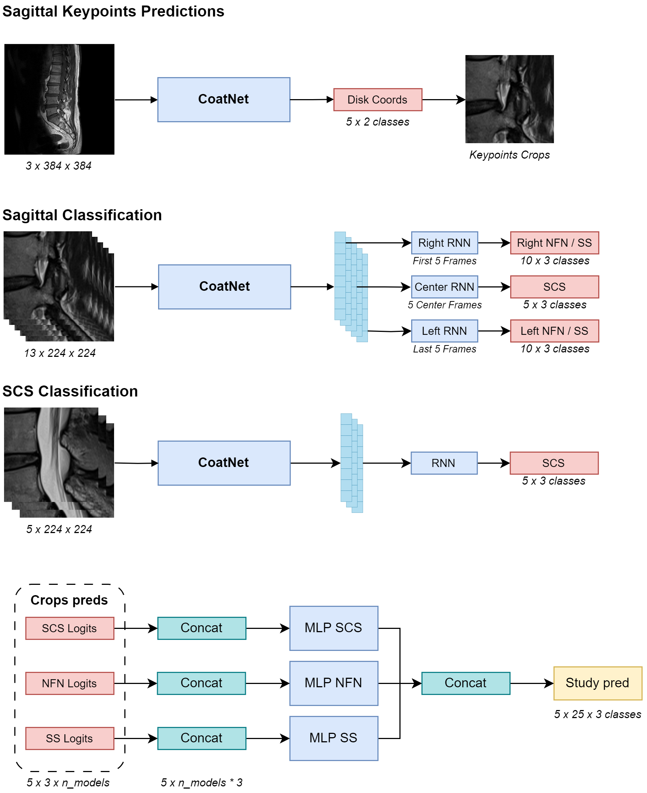

# 6th Place Solution to the RSNA 2024 Lumbar Spine Degenerative Classification Competition - Theo's part

**Authors :** [Theo Viel](https://github.com/TheoViel)

## Introduction - Adapted from [Kaggle](https://www.kaggle.com/competitions/rsna-2024-lumbar-spine-degenerative-classification/discussion/541813)

This repo contains Theo's part of team **NVSpine** solution to the RSNA 2024 competition, which achieved 6th place. These models alone are enough to reach a private score of 0.42 (~top15) using only the sagittal data.

### Overview

The pipeline is illustrated below, the approach has 3 components:
- The coordinate models : it detects the vertebral disks ROI using an efficient 2D approach to generate crops.
- The crop classification models :
    - Predict the SCS, NFN and SS targets at disk level on the sagittal images.
    - SCS only, predict the severity of the SCS class using Sagittal T2 images.
- The aggregation MLP :
    - A very minimalistic model to merge prediction and account for the competition metric



### Details

#### Coordinates model

A simple `coatnet_rmlp_2_rw_384` trained on all the center frames of the sagittal images to predict the 5 (x, y) coordinates associated with the disk injuries. It is trained with the MSE on 10 classes, and used to generate crops. Crop generation is done by selecting the square of 20% of the image size around the predicted ROI center.

#### Classification models

On the crop above, I once again trained CoAtNets, this time `coatnet_1_rw_224` and `coatnet_2_rw_224`, with a RNN layer to incorporate the 3D information. 
Initially, I wanted to train separate models for each injury since each image modality had its target. For instance the SCS only models are trained to predict the 3 severity classes on the Sagittal T2 images, by sampling the 5 (or 3) frames at the center of the stack.
But handling the two sagittal modalities together worked better, so I trained a 5-frame model on all the targets (including SS!) using the sagittal data. 
Further improvements came from adding more frames (5 is not enough to capture the SCS and SS signal) and using 3 RNN heads that had access to different frames - for the left, right and center (scs) targets. I also added MixUp and trained models for 10 epochs (vs 5 for the SCS models) and with a higher learning rate (1e-3 vs 5e-4 for the SCS models). 
Overall the training code and architecture are very similar to my solution to last year's RSNA challenge. 

#### MLP

The classification models are trained with the CE, and tweaked to maximize the AUC. The MLP model is here to aggregate predictions, and account for the competition metric (just like last year!). Surprisingly, what worked best here is to consider each target independently, i.e. the scs_l1_l2 does not interact with the scs_l2_l3 features nor the nfn_left_l1_l2 features in the MLP. The logits layer weights for the different levels are shared though, i.e. the model consists of 3 MLP (one for SCS, one for SS and one for SCS).

### Scores

|         | SCS  | NFN  | SS   | ANY  | CV   |      |  Public LB | Private LB |
|---------|------|------|------|------|------|------|------------|------------|
| Loss    | 0.268| 0.486| 0.562| 0.261| 0.394|      | 0.370      | 0.420      |


Ensembling with Christof and Darragh's pipelines achieves 13th place public and 6th place private. Ensembling is simply done by concatenating the features in the MLP model.

|         | SCS  | NFN  | SS   | ANY  | CV   |      |  Public LB | Private LB |
|---------|------|------|------|------|------|------|------------|------------|
| Loss    | 0.260| 0.475| 0.538| 0.255| 0.382|      | 0.355      | 0.401      |


## How to use the repository

### Prerequisites

- Clone the repository, and create the `input`, `logs` and `output` folders at the root.

- Download the data in the `input` folder:
  - [Competition data](https://www.kaggle.com/competitions/rsna-2024-lumbar-spine-degenerative-classification/data). 
  - [External coordinates data](https://www.kaggle.com/datasets/brendanartley/lumbar-coordinate-pretraining-dataset/versions/1), thanks to [Bartley](https://www.kaggle.com/brendanartley) for sharing ! Put everything in a `coords` folder. I used the version 1 of the dataset.
  - The folds file is available [here](https://www.kaggle.com/datasets/theoviel/rsna-2024-debug/data?select=train_folded_v1.csv), but you can also use yours .

Structure should be :

```
input
├── coords                      # Coordinates data
│   ├── data                    # From the external dataset
│   │   └── <imgs>.png
│   └── coords_comp.csv
├── test_images                 # Competition data
│   └── <studies/>
├── train_images                # Competition test data
│   └── <studies/>
├── sample_submission.csv
├── test_series_description.csv
├── train.csv
├── train_folded_v1.csv
├── train_label_coordinates.csv
└── train_series_description.csv
```

- Setup the environment :
  - `pip install -r requirements.txt`

- I also provide trained model weights :
  - [part 1](https://www.kaggle.com/datasets/theoviel/rsna-2024-weights-1), [part 2](https://www.kaggle.com/datasets/theoviel/rsna-2024-weights-2)

- Inference:
    - The team inference code on Kaggle is available [here](https://www.kaggle.com/code/theoviel/rsna-lumbar-spine-ens)
    - The simplified pipeline with Theo's code only is available [here](https://www.kaggle.com/theoviel/rsna-lumbar-spine-inf), or in the notebook `notebooks/Inference.ipynb`


### Run The pipeline

#### Preparation

1. Run the notebook `notebooks/Preparation.ipynb` to prepare the competiton data.
2. Run the notebook `notebooks/Coords.ipynb` to prepare the coordinates data.


After running the data preparation pipeline, structure should be :

```
input
├── coords                      # Coordinates data
│   ├── data                    # From the external dataset
│   │   └── <imgs>.png
│   ├── comp_data               # From the competition
│   │   └── <imgs>.png
│   ├── coords_pretrain.csv
│   └── coords_comp.csv
├── npy2  # Preprocessed competiton images
│   └── <study_series>.npy
├── test_images                 # Competition data
│   └── <studies/>
├── train_images                # Competition test data
│   └── <studies/>
└── <csv_files>.csv
```

#### Training

1. `bash coords.sh` will train the coordinates model. 
2. Run the notebook `notebooks/CoordsInf.ipynb` to perform inference and save the preprocessed crops.
3. `bash train.sh` will train the classification models:
   - Two SCS models: one with 5 frames and the `coatnet_1 `backbone, the other with 3 frames and the `coatnet_2 backbone`
   - Two SCS+NFN+SS models: One with flip augmentation and the other with fixed training frames
4. Run the notebook `notebooks/Training_Lvl2.ipynb` to train the MLP model.
   - You will need to update the configs to use the weights of your models.

### Code structure

If you wish to dive into the code, the repository naming should be straight-forward. Each function is documented.
The structure is the following :

```
src
├── data
│   ├── dataset.py              # Dataset classes
│   ├── loader.py               # Dataloader
│   ├── preparation.py          # Dataframe preparation
│   ├── processing.py           # Data processing
│   └── transforms.py           # Augmentations
├── inference
│   ├── dataset.py              # Inference datasets
│   ├── lvl1.py                 # 2D models inference utils for Kaggle
│   └── utils.py                # Inference utils
├── model_zoo 
│   ├── layers.py               # Custom layers
│   ├── models_lvl2.py          # MLP level 2 model
│   └── models.py               # Classification & Coords models
├── training                        
│   ├── losses.py               # Losses
│   ├── main_lvl2.py            # k-fold and train function for level 2 models
│   ├── main.py                 # k-fold and train function for the models
│   ├── mix.py                  # Cutmix and Mixup
│   ├── optim.py                # Optimizers
│   └── train.py                # Torch fit and eval functions
├── util
│   ├── logger.py               # Logging utils
│   ├── metrics.py              # Metrics for the competition
│   └── torch.py                # Torch utils
├── main_coords.py              # Trains the coordinates model
├── main_crop.py                # Trains the 1st crop model
├── main_crop_2.py              # Trains the 2nd crop model
├── main_crop_scs.py            # Trains the 1st SCS model
├── main_crop_scs_2.py          # Trains the 2nd SCS model
└── params.py                   # Main parameters
``` 
